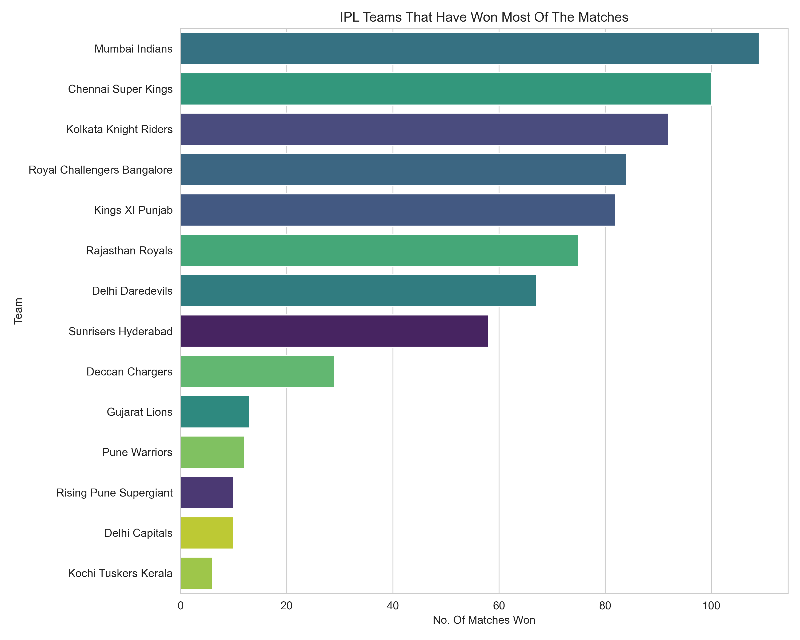
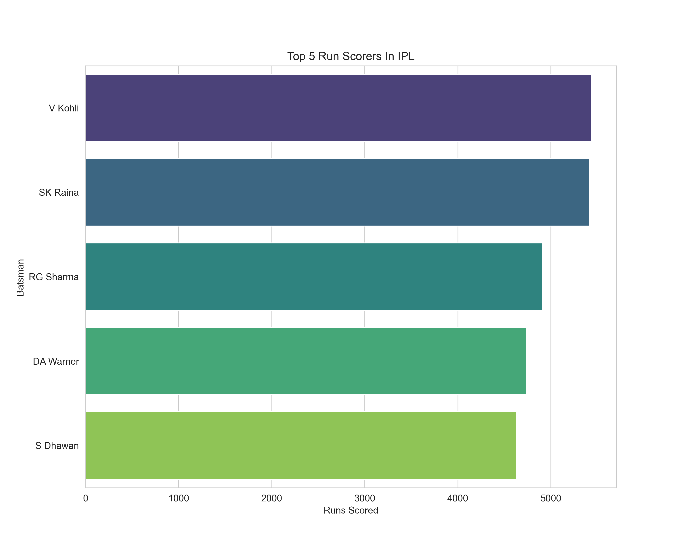
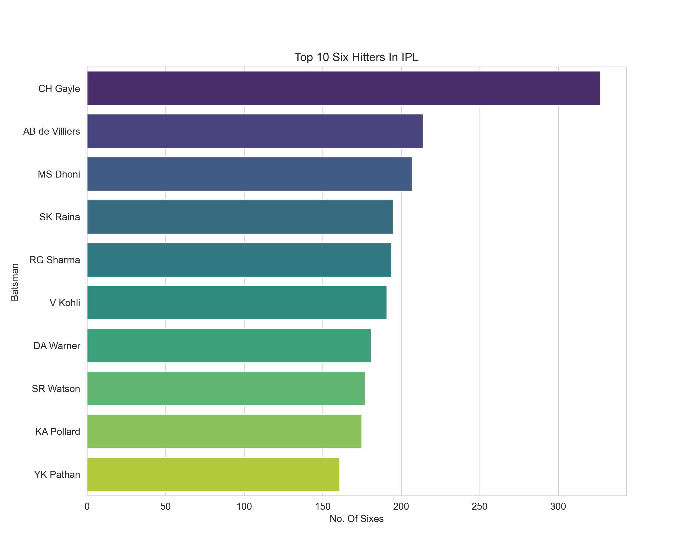
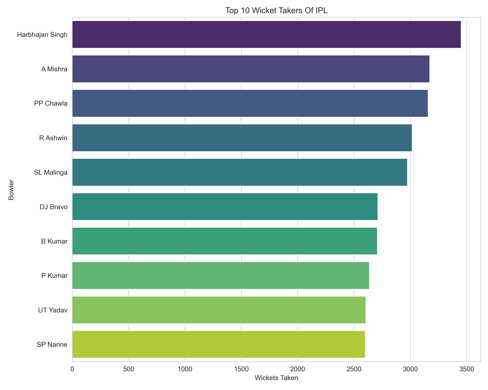
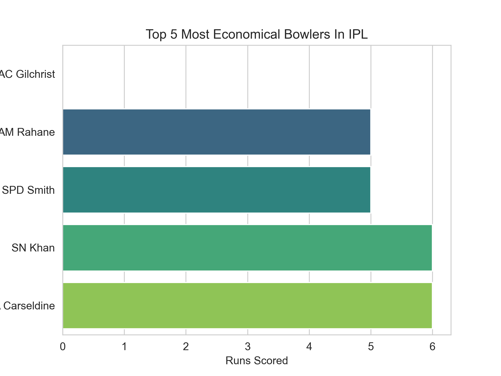
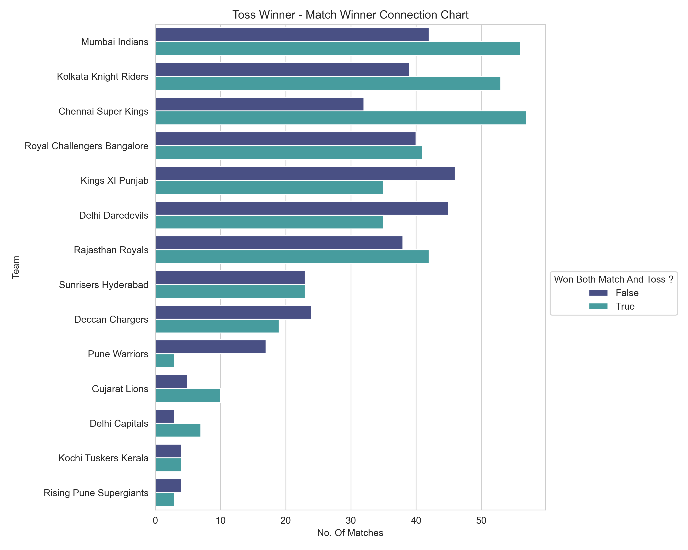
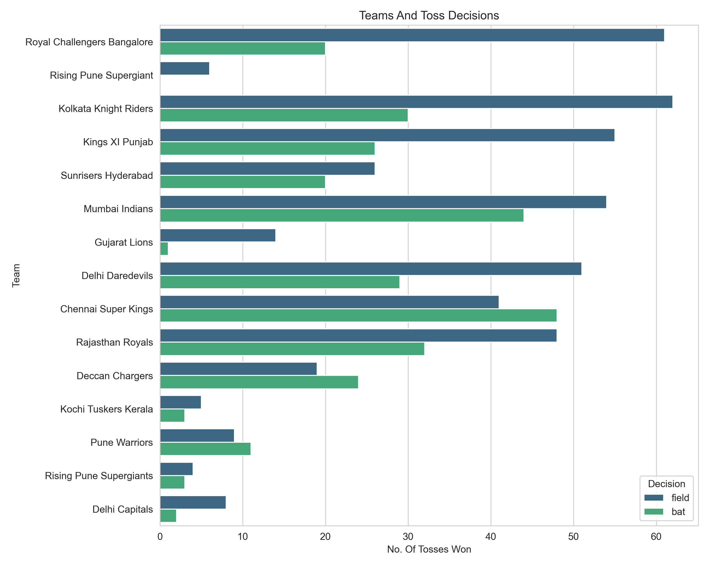

# IPL Data Analysis

## Project Overview

This project performs Exploratory Data Analysis (EDA) on Indian Premier League (IPL) data using Python, Pandas, NumPy, Matplotlib, and Seaborn.

The analysis explores:

- Match Trends
- Team Performance
- Batting Performance
- Bowling Performance
- Toss Impact
- Stadium Analysis
- Seasonal Trends
- Comparative Insights

Using over 750 IPL matches and 179,000+ ball-by-ball records, this project uncovers patterns, player performances, venue influences, and strategic trends across IPL history.

---

## Datasets Used

### matches.csv

Contains match-level information including:

- Teams
- Toss Winner
- Match Winner
- Stadium
- Season
- Player of the Match
- Match Result

### deliveries.csv

Contains ball-by-ball information including:

- Batsman
- Bowler
- Runs
- Extras
- Wickets
- Dismissals

---

## Technologies Used

- Python
- Pandas
- NumPy
- Matplotlib
- Seaborn

---

## Project Structure

```text
IPL-Data-Analysis/
│
├── IPL_Analysis.py
├── README.md
│
└── Graphs_And_Charts/
    ├── Most_Successful_Teams.png
    ├── Top_IPL_Stadiums.png
    ├── Highest_Playerofmatch.png
    ├── Tosswinner-Matchwinner.png
    ├── Top_IPL_Seasons.png
    ├── Top_runscorer.png
    ├── Top_sixhitters.png
    ├── Top_Fourhitters.png
    ├── Top_Battsman_Playingmostballs.png
    ├── TOP10_Bowlers.png
    ├── Top_Economical_Bowlers.png
    ├── Top_Expensive_Bowlers.png
    ├── Top_Bowlers.png
    ├── Team_Toss_Decision.png
    ├── victories-Toss_Decision.png
    ├── Stadium-Toss_Decision.png
    ├── Stadium-Winner_Team.png
    └── Season-Winner_Team.png
```

---

# Analysis Performed

## 1. Dataset Assessment

- Data Types Inspection
- Missing Value Analysis
- Duplicate Record Detection
- Dataset Overview

---

## 2. Match Analysis

- Most Successful IPL Teams
- Most Frequently Used Stadiums
- Player of the Match Analysis
- Toss Winner vs Match Winner Analysis
- Season-wise Match Count Analysis

---

## 3. Batting Analysis

- Highest Run Scorers
- Most Sixes
- Most Fours
- Most Balls Faced

---

## 4. Bowling Analysis

- Highest Wicket Takers
- Most Economical Bowlers
- Most Expensive Bowlers
- Bowlers Delivering Most Balls

---

## 5. Team Analysis

- Toss Decision Preferences
- Team-wise Toss Trends

---

## 6. Comparative Analysis

- Toss Decision vs Match Victory
- Stadium-wise Toss Decisions
- Stadium-wise Winning Teams
- Season-wise Dominant Teams

---

# Key Insights

## Match Analysis

### Team Performance

- Mumbai Indians (MI) emerged as the most successful IPL franchise.
- Chennai Super Kings (CSK) and Kolkata Knight Riders (KKR) followed closely behind.
- MI, CSK, and KKR consistently maintained strong winning records across seasons.

### Stadium Analysis

- Eden Gardens hosted the highest number of IPL matches.
- M. Chinnaswamy Stadium and Wankhede Stadium were among the most frequently used venues.
- These stadiums have remained central venues throughout IPL history.

### Player of the Match Awards

- Chris Gayle secured one of the highest numbers of Player of the Match awards.
- AB de Villiers and MS Dhoni also featured among the most awarded players.
- Their appearance in both award statistics and batting statistics highlights their match-winning impact.

### Toss Impact

- Approximately half of IPL teams showed noticeably better win records after winning the toss.
- MI, KKR, and CSK benefited particularly strongly from toss victories.
- Toss outcomes appear to provide a measurable advantage in many situations.

### Seasonal Trends

- IPL seasons 2011, 2012, and 2013 contained the highest number of matches.
- These seasons contributed significantly to the overall IPL dataset.

---

## Batting Analysis

### Run Scorers

- Virat Kohli and Suresh Raina ranked among the highest run scorers in IPL history.
- Their consistency over many seasons allowed them to accumulate exceptional run totals.

### Six-Hitting Ability

- Chris Gayle dominated six-hitting statistics by a significant margin.
- AB de Villiers and MS Dhoni followed among the leading six hitters.
- The overlap between Player of the Match awards and six-hitting statistics highlights the influence of aggressive batting on match outcomes.

### Boundary Analysis

- Shikhar Dhawan and Suresh Raina ranked among the top four-hitters.
- Unlike Gayle's power-focused approach, these players accumulated runs through consistent stroke play.

### Balls Faced

- Virat Kohli and Suresh Raina faced the highest number of deliveries in IPL history.
- Their presence among both top scorers and most balls faced indicates exceptional longevity and consistency.

### Chris Gayle's Batting Style

- Despite being one of the highest run scorers and the leading six hitter, Chris Gayle appeared much lower in balls faced rankings.
- This suggests a highly aggressive, high-impact batting approach that generated large scores without requiring long innings.

---

## Bowling Analysis

### Wicket Takers

- Lasith Malinga emerged as the highest wicket taker in IPL history.
- Dwayne Bravo followed closely among the leading wicket takers.
- Harbhajan Singh ranked among the top wicket-taking bowlers, highlighting his longevity and consistency across multiple IPL seasons.
- These bowlers combined wicket-taking ability with long careers, allowing them to accumulate impressive records.

### Economical Bowlers

- Adam Gilchrist and Ajinkya Rahane appeared among the most economical bowlers in the dataset.
- However, this result should be interpreted cautiously because these players bowled very few deliveries.
- Small sample sizes can create misleading economy-related statistics.

### Most Expensive Bowlers

- Harbhajan Singh, Piyush Chawla, and Amit Mishra appeared among the bowlers who conceded the highest total runs.
- This is largely due to the large number of overs and deliveries they bowled throughout their IPL careers rather than poor bowling performance.

### Interesting Relationship

- Harbhajan Singh, Piyush Chawla, and Amit Mishra appear among:
  - Bowlers who delivered the most balls
  - Bowlers who conceded the most total runs

- This suggests that bowlers who play for many seasons naturally accumulate:
  - More wickets
  - More deliveries bowled
  - More runs conceded

- Therefore, high total runs conceded should not automatically be interpreted as poor bowling performance.

---

## Team Analysis

### Toss Decisions

- Most IPL teams preferred fielding after winning the toss.
- Royal Challengers Bangalore (RCB) showed a particularly strong preference for fielding first.
- Chennai Super Kings (CSK) displayed a more balanced approach, choosing both batting and fielding frequently.

---

## Comparative Analysis

### Toss Decision vs Victory

- Teams choosing to field after winning the toss recorded more victories than teams choosing to bat first.
- This suggests that chasing may provide a strategic advantage under many IPL conditions.

### Stadium Trends

- Fielding was the dominant toss decision across major IPL venues.
- Teams generally preferred chasing regardless of stadium.

### Home Ground Dominance

- Kolkata Knight Riders (KKR) won the most matches at Eden Gardens.
- Royal Challengers Bangalore (RCB) dominated at M. Chinnaswamy Stadium.
- Mumbai Indians (MI) performed exceptionally strongly at Wankhede Stadium.

These patterns suggest a noticeable home-ground advantage for several franchises.

### Season Dominance

- KKR dominated the 2012 season.
- MI and CSK were among the strongest teams during the 2011–2013 period.
- These franchises consistently remained among IPL's top-performing teams.

---

# Sample Visualizations

## Most Successful IPL Teams



---

## Top Run Scorers



---

## Top Six Hitters



---

## Top Wicket Takers



---

## Most Economical Bowlers



---

## Toss Winner vs Match Winner



---

## Team Toss Decisions



---

# Conclusion

This project explores IPL history through match-level and ball-by-ball analysis to identify trends in team success, batting performance, bowling performance, venue influence, and toss strategy.

The findings highlight:

- The long-term dominance of franchises such as MI, CSK, and KKR.
- The impact of aggressive batsmen such as Chris Gayle, Virat Kohli, AB de Villiers, and Suresh Raina.
- The importance of experienced bowlers such as Lasith Malinga, Dwayne Bravo, and Harbhajan Singh.
- The influence of toss decisions and home-ground advantages on match outcomes.
- The relationship between longevity, wickets taken, deliveries bowled, and total runs conceded among leading bowlers.

Overall, this project demonstrates how exploratory data analysis can transform raw sports data into meaningful insights and visual stories using Python's data analysis and visualization ecosystem.